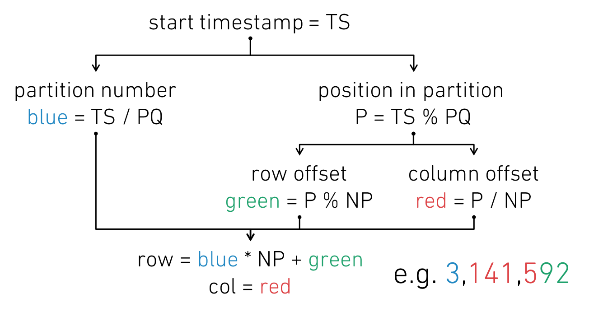

# 16. Use the tickets encoding for the transactions table (_transactions2)

Date: 05/04/2019

## Status

Technical decision has been accepted.
This architectural decision record is still a work in progress.

## Context

### The Transactions Table in AtlasDB

In AtlasDB, the ``_transactions`` table keeps track of whether a transaction that had started at a given timestamp
was committed or aborted (and in the case of it being committed, its commit timestamp). Logically, this table is a
mapping of longs to longs, with a special value of ``-1`` meaning that the transaction was aborted. Transactions that
are in-flight and have yet to either commit or abort will not have an entry in the table.

| startTimestamp | commitTimestamp |
|---------------:|----------------:|
|             20 |              33 |
|             28 |              42 |
|             37 |              -1 |
|        3141592 |         3141595 |

This table is accessed via the ``TransactionService`` class in AtlasDB, which offers a simple interface:

```java
public interface TransactionService {
    @CheckForNull
    Long get(long startTimestamp);

    Map<Long, Long> get(Iterable<Long> startTimestamps);

    void putUnlessExists(long startTimestamp, long commitTimestamp) throws KeyAlreadyExistsException;
}
```

In practice, calling both the single and multi-timestamp versions of ``get`` may read from this table, though
non-null results may be cached. ``putUnlessExists`` performs a put-unless-exists operation to the table - this
is supported by means of a Thrift ``cas`` call for Cassandra KVS, and by ``INSERT ... IF NOT EXISTS`` SQL statements
in relational KVSes.

### Physical Representation in Cassandra

All AtlasDB tables have a similar schema in Cassandra:

- there is a blob partition key used to store rows, called the ``key``
- the clustering key has two more components:
  - a blob for columns, called ``column1``
  - a big-integer for the timestamp, called ``column2``
- blob values.

In the ``_transactions`` table, ``column1`` is always a single byte corresponding to the string ``t``, and
``column2`` is a special value of ``-1``. In practice, we don't pay much attention to these values.
More interestingly, the ``key`` is a VAR_LONG encoding of the start timestamp, and the ``value``
is similarly a VAR_LONG encoding of the commit timestamp.

The Cassandra representation of the ``_transactions`` table introduced above may look as follows.

|        key | column1 | column2 |                  value |
|-----------:|--------:|--------:|-----------------------:|
|       0x14 |    0x74 |      -1 |                   0x21 |
|       0x1c |    0x74 |      -1 |                   0x2a |
|       0x25 |    0x74 |      -1 | 0xff80ffffffffffffffff |
| 0xe02fefd8 |    0x74 |      -1 |             0xe02fefdb |

The details of VAR_LONG encoding are fiddly, but it exhibits several desirable properties:

1. VAR_LONG encoding is order-preserving over non-negative numbers; that is, if 0 <= ts1 < ts2
   then VAR_LONG(ts1) < VAR_LONG(ts2) and vice versa. This is significant, because it allows one to perform
   range scans of the transactions table (given that timestamps in Atlas are positive longs) in a straightforward
   way.
2. VAR_LONG encoding supports negative numbers, meaning that we can use the same encoding for both positive timestamps
   (for transactions that successfully committed) and ``-1`` (for transactions that were aborted).

However, our choice of encoding also has some issues. Two particularly relevant ones are as follows:

1. Under VAR_LONG encoding, numbers that are near to each other numerically will also be very close in byte-space
   (notice that the encoded forms of 3141592 and 3141595 only differ in their three lowest-order bits). Furthermore,
   most writes to the transactions table will take place at numbers that are numerically close, because these
   correspond to actively running transactions, and thus at keys that are close in byte-space. Considering that
   Cassandra uses consistent hashing to handle data partitioning, at any given point in time the majority of writes
   to the cluster will end up going to the same node ('hot-spotting'). This is undesirable, because we lose
   horizontal scalability; writes are bottlenecked on a single node regardless of the size of the cluster.
2. VAR_LONG encoding is not particularly efficient for our purposes in that it fails to exploit some characteristics
   of the distribution of our data. In particular:
   1. The special value ``-1`` is particularly large; under VAR_LONG encoding, negative longs will always encode to 10
      bytes.
   2. Storing the full value of the commit timestamp is also wasteful, given that we know that it is generally slightly
      higher than the value of the start timestamp.

### Principles for a Good Transaction Service

We thus define three principles that we can use to help guide our decisions as to what makes an implementation of
a transaction service a good one.

1. **Horizontal Scalability (HS)**: A good transactions service must be horizontally scalable; that is, it should be
   possible to increase write bandwidth by increasing the number of database nodes and/or service nodes that are
   performing writing.
2. **Compact Representation (CR)**: A good transactions service does not unnecessarily use excessive disk space.
   In addition to saving on disk usage, having a compact representation also improves the ability for query results to
   be cached in memory, and can improve time taken to execute queries if less data needs to be read through from disk.
3. **Range Scans (RS)**: A good transactions service supports range scans (without needing to read the entire table
   and post-filter it). This is used in various backup and restore workflows in AtlasDB, and it is important that we
   are able to execute restores in a timely fashion.
4. **Reasonable Usage Patterns (RUP)**: A good transactions service, if using an underlying service, must follow
   standard principles as to what constitutes a reasonable usage pattern of the underlying service.

## Decision

Implement the tickets encoding strategy, along with other features needed to support its efficient operation.
The strategy and supporting features will be introduced in the following sections.

### Tickets Encoding Strategy: Logical Overview

We divide the domain of positive longs into disjoint *partitions* of constant size - we call the size the
*partitioning quantum* (PQ). These partitions are contiguous ranges that start at a multiple of PQ - thus, the first
partition consists of timestamps from 0 to PQ - 1, the second from PQ to 2 * PQ - 1 and so on.

We assign a constant number of rows to a partition (NP), and seek to distribute start timestamps as evenly as possible
among these NP rows as numbers increase. In practice, the least significant bits of the timestamp will be used as
the row number; we would thus store the value associated with the timestamps k, NP + k, 2NP + k and so on in the same
row, for a given partition and value of k in the interval [0, NP). To disambiguate between these timestamps, we use
dynamic column keys - we can use a VAR_LONG encoding of the timestamp's offset relative to the base.

More formally, for a given timestamp TS, we proceed as follows (where / denotes integer division):

- we identify which row R TS belongs to; this is given by (TS / PQ) * NP + (TS % PQ) % NP.
- we identify the column C TS belongs to; this is given by (TS % PQ) / NP.

Notice that given R and C, we can similarly decode the original TS:

- we identify the relevant partition P; this is given by R / NP.
- we identify the offset from the column key, O1; this is given by C * NP.
- we identify the offset from the second part of the row key, O2; this is given by R % NP.
- the original timestamp is then P * PQ + O1 + O2.

It may be easier to think of the timestamp being written as a 3-tuple (P, O1, O2), where the row component is the
pair (P, O2) and the column key is O1; if NP divides PQ, then there is a bijection between such 3-tuples where O2 ranges
from 0 to NP (exclusive), and O1 ranges from 0 to PQ / NP (exclusive). Furthermore, this bijection is order-preserving
where ordering over the 3-tuples is interpreted lexicographically.

This diagram should illustrate more clearly how this works, for PQ = 1,000,000 and NP = 100.



### Physical Implementation of Tickets

We store information about transactions committed under the new encoding scheme in the ``_transactions2`` table in
Cassandra.
Given that we want to avoid hot-spotting and ensure horizontal scalability, we need to ensure that the rows we may
be writing data to are distributed differently in byte-space. We thus reverse the bits of each row before encoding it.

```java
private static byte[] encodeRowName(long startTimestamp) {
    long row = (startTimestamp / PARTITIONING_QUANTUM) * ROWS_PER_QUANTUM
            + (startTimestamp % PARTITIONING_QUANTUM) % ROWS_PER_QUANTUM;
    return PtBytes.toBytes(Long.reverse(row));
}
```

We are using a fixed-long encoding here, which uses a constant 8 bytes (instead of variable between 1 and 9). This was
chosen to ensure that range scans are supported, as the reversed forms of variable length encodings tend to not be
amenable to range scans.

For the dynamic column keys, we simply use VAR_LONG encoding.

We changed the encoding of values as well. For transactions that successfully committed, we used a delta encoding
scheme instead, where we take the VAR_LONG of the difference between the commit and start timestamps, which is
typically a small positive number. This helps to keep the size of the table down. Separately, for transactions that
were aborted, we store an empty byte array as our special value instead of a negative number, because that is
unnecessarily large.

### Choosing PQ and NP

We choose values of PQ and NP based on characteristics of the key-value-service in which we are storing the timestamp
data, recalling principle RUP. To simplify the discussion in this section, we assume NP divides PQ.

For Cassandra, following the Atlas team's recommended Cassandra best practices, we seek to bound the size of an
individual row by 100 MB. Considering that a VAR_LONG takes at most 9 bytes for positive integers, and we
can explicitly use an empty byte array to represent a transaction that failed to commit, we can estimate the
maximum size of a row for a given choice of values of PQ and NP.

Notice that the number of timestamps we actually need to store is given by PQ / NP (since each of the rows in the
partition is different). For a given start/commit timestamp pair, the row key occupies 8 bytes; that said, in SSTables
the row key only needs to be represented once. We thus focus on the column keys and values.

The column key is a VAR_LONG encoded number that is bounded by PQ / NP, as that's the largest offset we might actually
store. The value theoretically could go up to a full 9 bytes for a large positive number, though in practice is likely
to be considerably smaller.

We selected values of PQ = 25,000,000 and NP = 16. Under this configuration, each row stores at most 1,562,500
start-commit timestamp pairs. Thus, the numbers for the rows only go up to 1,562,500, and VAR_LONG encoding is able
to represent these within 3 bytes. We do need to account for a bit more space as Cassandra needs to create a
composite buffer to include the ``column2`` part of our physical row, but this should not take more than an additional
9 bytes. We thus have 12 bytes for the column key and 9 bytes for the value, leading to a total of 21 bytes per
start-commit timestamp pair. Each row is then bounded by about 32.04 MB, which leaves us quite a bit of headroom.

It is worth mentioning that in practice, for implementation reasons it is very unlikely that we have a full 1,562,500
start-commit timestamp pairs in a single row, and in practice values are likely to be only 2 or 3 bytes rather than
9 bytes. In any case, even under these adverse circumstances we still avoid generating excessively wide rows.

### Streamlining putUnlessExists

The putUnlessExists operation is performed at a serial consistency level in Cassandra, meaning that reads and writes
go through Paxos for consensus. Thrift exposes a check-and-set operation on its APIs.

```
CASResult cas(1:required binary key,
            2:required string column_family,
            3:list<Column> expected,
            4:list<Column> updates,
            5:required ConsistencyLevel serial_consistency_level=ConsistencyLevel.SERIAL,
            6:required ConsistencyLevel commit_consistency_level=ConsistencyLevel.QUORUM)
   throws (1:InvalidRequestException ire, 2:UnavailableException ue, 3:TimedOutException te)
```

This was sufficient in the original transactions schema, because each row key only stores information about one
start timestamp; a putUnlessExists operation is then a CAS from an empty row to a row that has one column.
However, notice that this is not sufficient for transactions2, because each row may contain data about multiple start
timestamps. This API requires us to provide a list of the old columns, and we don't know that beforehand.

We considered alternatives of reading the existing row and then adding the new columns, or using the CQL API, because
the behaviour of INSERT IF NOT EXISTS for columns matches the semantics we want. However, both of these solutions were
found to have unacceptable performance in benchmarking.

We thus decided to extend the Thrift interface to add support for a multi-column put-unless-exists operation that
has the semantics we want. This is different from CAS from an empty list, in that this succeeds as long as any of
the existing columns in the column family for the provided key do not overlap with the set of columns being added.

```
CASResult put_unless_exists(1:required binary key,
                          2:required string column_family,
                          3:list<Column> updates,
                          4:required ConsistencyLevel serial_consistency_level=ConsistencyLevel.SERIAL,
                          5:required ConsistencyLevel commit_consistency_level=ConsistencyLevel.QUORUM)
   throws (1:InvalidRequestException ire, 2:UnavailableException ue, 3:TimedOutException te)
```

#### Multinode Contention and Residues

This is an improvement, but still runs into issues when clients (whether across multiple service nodes or on the same
node) issue multiple requests in parallel, because each put_unless_exists request requires a round of Paxos. Cassandra
maintains Paxos sequences at the level of a partition (key), so these requests would contend as far as Paxos is
concerned, even if the columns are actually disjoint. Internally, Cassandra nodes are trying to apply updates to the
partition; whether these updates are applied and the order in which they take place is agreed on using Paxos.
Although the nodes will be OK with accepting multiple proposals if they don't conflict, only one round of consensus
can be committed at a time (since updates are conditional). Also, Cassandra uses a leaderless implementation of
Paxos, meaning that the 'dueling proposers' issue might slow an individual round of the protocol down if multiple nodes
are trying to concurrently propose values.

Batching requests on the client side for each partition could be useful, though that is still limited in that
performance would be poor for services with many nodes.

### Cassandra Table Tuning

When creating a table in Cassandra, one may specify table properties, which tune the way data is handled. We have
knowledge of the access patterns and data layout of the ``_transactions2`` table, and can use this to improve the
performance Cassandra is able to provide for our specific use cases.

#### Bloom Filters

Cassandra keeps track of bloom filters for each SSTable in memory to avoid having to read all SSTable data files. These
bloom filters keep track of whether an SSTable contains data for a specific row, and thus allows Cassandra to determine
without performing I/O operations whether a given SSTable

- probably contains data for that row, or
- definitely does not contain data for that row

The probability a bloom filter returns a false positive is configurable via ``bloom_filter_fp_chance``, though more
accurate bloom filters require more RAM. Cassandra documentation suggests that typical values lie between 0.01 and 0.1.
Typically, within AtlasDB, the false positive rate is set depending on whether a table is append heavy and read light
(which means it is given the size tiered compaction strategy), and whether negative lookups are expected to be
frequent. This is determined by user schemas.

```
static final double DEFAULT_LEVELED_COMPACTION_BLOOM_FILTER_FP_CHANCE = 0.1;
static final double DEFAULT_SIZE_TIERED_COMPACTION_BLOOM_FILTER_FP_CHANCE = 0.01;
static final double NEGATIVE_LOOKUPS_BLOOM_FILTER_FP_CHANCE = 0.01;
static final double NEGATIVE_LOOKUPS_SIZE_TIERED_BLOOM_FILTER_FP_CHANCE = 0.0001;
```

As far as transactions2 is concerned, we observe that the number of partitions is very small, and thus we can go with
a very low setting. We thus set ``bloom_filter_fp_chance`` to 0.0001. Empirically, we observed that for 1,000,000,000
timestamps, the bloom filter we had for the ``_transactions2`` table even with this setting was about 15 KB, while that
for ``_transactions`` was about 580 MB.

#### Index Intervals

In Cassandra, a partition index is an on-disk file that stores mappings from partition keys to their offset within
an SSTable. Cassandra maintains a partition summary for each SSTable in memory, which samples the partition index every
N keys and stores an offset for the location of the mapping for a given key within the file. The value of N may be
tuned; smaller values of N require more memory, but improve performance as seeks within the partition index will
be shorter.

For transactions2, the number of partitions is expected to be very small, so we set the ``min_index_interval`` and
``max_index_interval`` to 1, forcing the partition index to be perfect.

#### Compression Chunk Length

Cassandra compresses SSTables by blocks on disk. These blocks are of configurable size; choosing larger blocks may
enable better compression (since similarities between columns or values may be exploited) at the expense of needing
to read more data from disk when a read occurs. Typically in Atlas, this is set to 4 KB to reduce the amount of I/O
we need to do.

For transactions2, we expect that some users will often be reading data from a relatively smaller working set. In this
case, using a larger chunk size enables better compression and increases the proportion of said working set that can be
maintained in memory. We experimented with several settings and found 64 KB to be a good balance.

#### Empirical Evaluation of Cassandra Table Parameters

We ran several benchmarks on an internal testing stack, with different levels of concurrency and different hit rates
for the transactions table. For these benchmarks, we ensured that we actually performed disk operations to evaluate
performance. This was done by using ``sstableloader`` to ingest billions of timestamp pairs into the test stack, and
the ``stress`` tool to consume almost all of the free memory outside of Cassandra's heap (to avoid operating system
page caches). We also had to create fresh ``TransactionService``s on each benchmark run to circumvent application-level
caching.

These benchmarks were run with a 100% hit rate (every timestamp queried for corresponded to an existing transaction).
We attempted to run the tests using various configurations of the optimisations discussed above.

| Concurrency | Metric |    tx1 |    tx2 | tx2 + BF | tx2 + BFII | tx2 + BFIICK[16] | tx2 + BFIICK[64] |
|------------:|-------:|-------:|-------:|---------:|-----------:|-----------------:|-----------------:|
|         100 |    p50 |  2.263 |  2.549 |    2.733 |      2.705 |            2.702 |            2.362 |
|         100 |    p95 |  9.161 |  9.742 |    8.092 |      9.404 |            8.495 |            9.020 |
|         100 |    p99 | 15.687 | 16.424 |   15.502 |     15.850 |           15.096 |           15.983 |
|         250 |    p50 |  4.722 |  5.243 |    5.221 |      4.986 |            4.897 |            4.771 |
|         250 |    p95 | 21.538 | 20.365 |   19.167 |      18.15 |           21.634 |           19.999 |
|         250 |    p99 | 37.190 | 33.597 |   27.177 |     31.870 |           34.593 |           36.446 |

These benchmarks were run with a 50% hit rate. Note that this is rare in practice, as in practice after each miss we
will try to roll back the transaction by inserting a -1 entry into the transactions table.

| Concurrency | Metric |    tx1 |    tx2 | tx2 + BF | tx2 + BFII | tx2 + BFIICK[16] | tx2 + BFIICK[64] |
|------------:|-------:|-------:|-------:|---------:|-----------:|-----------------:|-----------------:|
|         100 |    p50 |  2.319 |  3.386 |    3.456 |      3.548 |            3.685 |            3.383 |
|         100 |    p95 | 10.667 | 10.093 |    9.170 |      9.124 |            8.607 |           10.247 |
|         100 |    p99 | 16.652 | 16.886 |   15.235 |     15.374 |           14.337 |           15.926 |
|         250 |    p50 |  5.166 |  7.728 |    7.436 |      7.643 |            7.761 |            7.308 |
|         250 |    p95 | 18.917 | 22.379 |   20.847 |     20.801 |           20.192 |           20.215 |
|         250 |    p99 | 35.315 | 35.510 |   32.391 |     32.369 |           31.115 |           32.746 |

We determined that our final choice of settings (BFIICK[64]) brought transactions2 read performance mostly in line with
that of transactions1 for a 100% hit rate. Also notice that there seems to be some regression in un-optimised
transactions2, so our optimisations have probably been useful.

It seems that there is a performance hit at lower percentiles for the 50% hit rate test, though we deem this to not
be too bad as each read of a miss will make future reads of the same value (modulo race conditions) be a hit, meaning
that this is unlikely to be a steady state.

### Cell Loader V2

#### Background on Cell Loading

AtlasDB loads most of its data through the ``multiget_slice`` Cassandra endpoint.

```
map<binary,list<ColumnOrSuperColumn>> multiget_slice(1:required list<binary> keys,
                                                   2:required ColumnParent column_parent,
                                                   3:required SlicePredicate predicate,
                                                   4:required ConsistencyLevel consistency_level=ConsistencyLevel.ONE)
                                    throws (1:InvalidRequestException ire, 2:UnavailableException ue, 3:TimedOutException te)
```

A ``SlicePredicate`` is a Cassandra struct that allows clients to specify which columns they want to read - these
columns are loaded for each of the keys presented. Notice that this method supports multiple keys but just one
predicate.

Thus, in Atlas when we try and perform a get of a collection of cells (which are row-column pairs), we first
group the pairs by column and then, in parallel, dispatch requests to Cassandra for each row that is relevant.
For example, if one's cells were ``(A, 1), (A, 2), (B, 1), (C, 2), (C, 3), (D, 3)``, then Atlas would send three
requests:

- column ``1`` and keys ``[A, B]``
- column ``2`` and keys ``[A, C]``
- column ``3`` and keys ``[C, D]``

Note that in practice, the requests we make have to use a range predicate on Cassandra, because cells don't include
timestamps, and the latest timestamp at which our cell existed isn't something we know a priori.

#### Multiget Multislice

The above model does not work well for transactions2. Transactions2 cells end up being distributed reasonably evenly
among the columns 0 through PQ / NP (which, in our case, is 312,500). Thus, when attempting to determine whether some
Atlas values had been committed, we will perform many requests in parallel. These requests will end up using many
resources from the Cassandra connection pool; they also incur a lot of overhead in terms of scheduling and network I/O.

We want to be able to batch these calls together. To do this, we added another endpoint to the Thrift interface that
Palantir's fork of Cassandra provides:

```
struct KeyPredicate {
    1: optional binary key,
    2: optional SlicePredicate predicate,
}

map<binary,list<list<ColumnOrSuperColumn>>> multiget_multislice(1:required list<KeyPredicate> request,
                                                              2:required ColumnParent column_parent,
                                                              3:required ConsistencyLevel consistency_level=ConsistencyLevel.ONE)
                                    throws (1:InvalidRequestException ire, 2:UnavailableException ue, 3:TimedOutException te)
```

Implementing this endpoint on the Cassandra side was not too difficult. It may seem a little wasteful in that this may
require keys and predicates to be specified more than once, but for transactions2 these would likely be mostly
distinct.

While this improved performance, we still faced significant regressions relative to the v1 cell loader. We determined
that this was because Cassandra has a worker pool for loading values to satisfy a ``ReadCommand``, but the calling
thread in requests is also allowed to participate. Thus, creating large batches would turn out to likely be detrimental
to read performance, even when the Cassandra nodes are actually able to handle higher concurrency safely.

#### Selective Batching


### Live Migrations and the Coordination Service

## Consequences

### Write Performance

### Read Performance

### Data Compression

### Operational Concerns

#### Backup and Restore

#### Cassandra Dependencies

#### Safe Installation

## Alternatives Considered

### Use TimeLock / other Paxos mechanism for transactions

### The Row-Tickets Algorithm

### Multiget Multislice Exactly

## Future Work

### DbKVS and Transactions2
